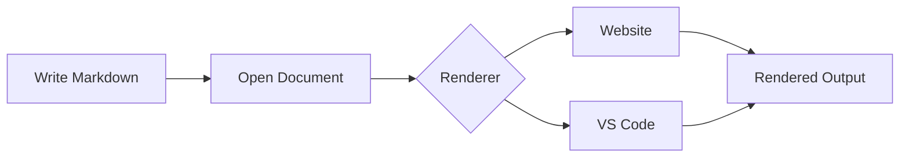

# Markdown Feature Test

This document is a **manual test fixture** for developers. Paste it into the
website editor or open it in VS Code with the MyMarkdown extension to compare
how features render.

It covers **10 Markdown features** plus common regression cases.

---

## 1. Math

Inline math:

$E = mc^2$

Block math:

$$
f(x) = \frac{1}{\sqrt{2\pi}} e^{-x^2/2}
$$

---

## 2. Tables

| Feature | Website | VS Code |
|---|---|---|
| Tables | ✅ | ✅ |
| Math | ❌ | ✅ |
| Footnotes | ✅ | ❌ |

Aligned columns:

| Left | Center | Right |
|:-----|:------:|------:|
| a | b | c |
| longer text | mid | 42 |

---

## 3. Footnotes

Markdown can include footnotes.[^1]

Here is another footnote.[^2]

[^1]: This is the first footnote.
[^2]: This is the second footnote with more information.

---

## 4. Task Lists

### My tasks

- [x] Create Markdown renderer
- [x] Add tables
- [ ] Add math support
- [ ] Add emoji support
- [ ] Ship the next version

Nested tasks:

- [x] Parent done
  - [x] Child done
  - [ ] Child pending
- [ ] Parent pending

---

## 5. Highlight

This sentence contains ==highlighted text==.

You can also ==highlight an important idea== inside a paragraph.

---

## 6. Strikethrough

This feature is ~~not supported~~ supported.

Old price: ~~$99~~

New price: **$49**

---

## 7. Definition Lists

Markdown
: A lightweight markup language for creating formatted text.

Mermaid
: A syntax for creating diagrams from text.

KaTeX
: A library for rendering mathematical notation.

---

## 8. Alerts

> [!NOTE]
> This is useful information that users should know.

> [!TIP]
> You can use Markdown to keep documentation simple.

> [!WARNING]
> Be careful before changing production settings.

> [!IMPORTANT]
> Save your work before continuing.

> [!CAUTION]
> This action cannot be undone.

---

## 9. Emoji

Let's build something cool! :rocket:

Markdown is great for documentation :memo:

Everything is working :white_check_mark:

Developers love coffee :coffee:

---

## 10. Other Fences

### Chart

```chart
{
  "type": "bar",
  "data": {
    "labels": ["Jan", "Feb", "Mar"],
    "values": [20, 35, 50]
  }
}
```

### ABC Music Notation

```abc
X:1
T:Simple Scale
M:4/4
K:C
C D E F | G A B c |
```

### GeoJSON

```geojson
{
  "type": "Point",
  "coordinates": [-81.6944, 41.4993]
}
```

---

# Mermaid Test



---

## Current Support

| # | Feature | Website | VS Code Extension |
|---|---|:---:|:---:|
| 1 | Math `$...$`, `$$...$$` | ❌ | ✅ |
| 2 | Tables | ✅ | ✅ |
| 3 | Footnotes `[^1]` | ✅ | ❌ |
| 4 | Task lists `- [ ]` | ✅ | ✅ |
| 5 | Highlight `==text==` | ❌ | ❌ |
| 6 | Strikethrough `~~text~~` | ✅ | ✅ |
| 7 | Definition lists | ❌ | ❌ |
| 8 | Alerts `> [!NOTE]` | ❌ | ✅ |
| 9 | Emoji `:rocket:` | ❌ | ❌ |
| 10 | Other fences | ❌ | ❌ |

---

# Extra Regression Checks

Use these when fixing renderer, beautify, lint, or TOC bugs.

## Headings

# Heading 1

## Heading 2

### Heading 3

#### Heading 4

##### Heading 5

###### Heading 6

## Emphasis and inline

*italic*, **bold**, ***bold italic***, `inline code`, and a [link](https://mymarkdown.site).

Autolink: https://mymarkdown.site

Image (broken path is fine for fixture checks):


## Lists

Unordered:

- Item one
- Item two
  - Nested two-a
  - Nested two-b
- Item three

Ordered:

1. First
2. Second
   1. Nested 2.1
   2. Nested 2.2
3. Third

Mixed markers before Beautify (`*` and `+` should become `-`):

- star item
- plus item
- dash item

## Blockquote

> A simple blockquote.
>
> With a second paragraph.

## Code fences

Plain:

```
plain fence body
line two
```

JavaScript:

```js
function greet(name) {
  return `Hello, ${name}`;
}
```

JSON (valid — should pretty-print / colour):

```json
{
  "version": 2,
  "channel": "stable",
  "features": [
    "lint",
    "format",
    "preview"
  ]
}
```

JSON (invalid — should lint / leave alone carefully):

```json
{"broken": true,
```

Loose / bare JSON in prose (should promote to a fence on the website):

{"promote":true,"source":"bare"}

Backtick-wrapped JSON: `{"inline":true,"ok":1}`

## Horizontal rule

Above the rule.

---

Below the rule.

## Escapes

\*not italic\*, \`not code\`, \[not a link\](https://example.com)

Literal dollar without math: \$100

## HTML

<div>
  <p>Raw HTML block for renderer checks.</p>
</div>

Inline <code>HTML</code> and a <br> line break.

## Front matter shape

Documents that start with `---` may be treated as YAML front matter by some tools.
The fence/region scanner should leave real front matter alone. Example shape (commented
so this fixture itself stays normal Markdown):

```yaml
---
title: Fixture
draft: true
---
```

## Edge cases

Trailing spaces for a hard break (two spaces at end of next line):  
this line should continue after a break.

Unclosed fence (lint should warn) — leave the next fence intentionally open when
copying only that section; for the full fixture it is closed:

```text
intentionally closed so the rest of the document still parses
```

Heading jump for lint (H1 then H3):

# Lint jump parent

### Lint jump child (skips H2)

Done. Paste or open this file whenever you need a quick visual check.
