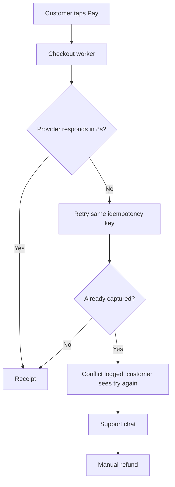

# Q3 2026 Support Report — Northline

**Period:** 1 July – 30 September 2026  
**Owner:** Support Operations  
**Status:** Final, for the 6 October review  
**Audience:** Product, Engineering, and Customer Success

This is a sample report for preview, table-of-contents, and labeling checks. It is written as a real document, not as a feature list. Open it the same way as [`markdown-feature-test.md`](markdown-feature-test.md): paste it into the website editor, or open it in VS Code and use the MyMarkdown preview.

---

## 1. Executive summary

Northline closed the quarter with **4,812** support conversations, up 11% from Q2. First response held inside the published target on business days. Resolution did not.

Two incidents account for most of the miss:

1. **NL-1842** — checkout retries piled up after a payments timeout on 14 August.
2. **NL-1901** — the status page stayed green while the EU read replica lagged on 2 September.

> [!IMPORTANT]
> Do not treat the headline volume number as healthy growth. About 380 of the new conversations are repeats of NL-1842. Strip those out and volume is roughly flat.


What changed for customers, in one line: checkout failures are visible again, and the EU status page now follows replica lag instead of only the primary.[^status]

---

## 2. Volume and outcomes

### 2.1 Where the conversations came from

| Channel | Q2 | Q3 | Share of Q3 | Notes |
|:--------|---:|---:|------------:|:------|
| In-app chat | 2,140 | 2,486 | 52% | Spike on 14–16 Aug |
| Email | 1,420 | 1,355 | 28% | Slightly down |
| Status page | 310 | 604 | 12% | Almost all NL-1901 |
| Enterprise desk | 466 | 367 | 8% | Renewals were quiet |

Aligned columns above are intentional: counts and shares should scan as numbers, and the notes column should stay left-aligned.

### 2.2 Did we keep the promise?

| Promise | Target | Q3 result | Verdict |
|:--------|:-------|:----------|:--------|
| First response, business hours | under 1 hour | 38 minutes median | Met |
| First response, weekends | under 4 hours | 3 hours 10 minutes | Met |
| Resolved within 1 business day | 95% | 91.4% | Missed |
| Reopened within 7 days | under 8% | 6.1% | Met |

The one-day figure is the one to argue about in the review. It looks like a small miss. It is not evenly spread.

- **How-to and setup:** 97% resolved inside a day.
- **Billing and refunds:** 74% resolved inside a day.
- **Incidents:** pulled the average down, then recovered once the write-up shipped.

Weekend coverage held because the on-call rotation added a second person in August. That was a trial. It is not funded past December.

### 2.3 Error budget

Published availability for checkout is 99.9% over a quarter. Allowed downtime is about 131 minutes. August used 96 of those minutes in a single afternoon.

$$
\text{budget remaining} = 1 - \frac{\text{downtime minutes}}{131}
$$

After NL-1842, remaining budget was $1 - 96/131 \approx 0.27$, so **27%** of the quarter's checkout budget was left with six weeks still to go. September did not spend it. The budget survived. The *experience* of 14 August did not, which is why the report leads with conversations rather than with the uptime percentage.

---

## 3. What broke

### 3.1 NL-1842 — checkout retries

**When:** 14 August, 15:40–17:16 UTC  
**Customer impact:** payments returned "try again" while the charge had sometimes already succeeded.  
**Support impact:** 380 new chats in 36 hours, many from the same account.

> [!WARNING]
> A retry that is safe for the customer is not the same as a retry that is safe for the ledger. Several customers were charged twice and only noticed on the receipt email.

#### What the queue looked like

The worker logged a timeout, then retried the same idempotency key. The second attempt reached the provider after the first had committed.

```text
15:41:02 ERROR checkout.charge timeout provider=harbor timeout_ms=8000
15:41:03 WARN  checkout.charge retry key=idem_8f3a attempt=2
15:41:11 ERROR checkout.charge conflict key=idem_8f3a state=captured
```

#### Why it lasted as long as it did

1. The alert fired on error *rate*, which stayed under the page threshold because most retries eventually returned success.
2. The duplicate-charge signal lives in the ledger, and that dashboard is not on the support war-room screen.
3. The public status page only watches the storefront health check, which stayed green.



#### What we told customers

The first reply macro still said "your card was not charged." That was true for some retries and false for others. The macro was pulled at 18:05 UTC and replaced with:

> We can see the charge on our side. If your bank shows it twice, reply with the two receipt times and we will refund the extra one today. You do not need to call your bank first.

That paragraph is the one worth keeping. It stopped the back-and-forth.

### 3.2 NL-1901 — EU replica lag

**When:** 2 September, 09:12–11:40 UTC  
**Customer impact:** the account page in `eu-central` showed yesterday's invoices. New invoices existed. The status page said operational.  
**Support impact:** 210 status-page subscriptions and a smaller chat spike. Enterprise accounts were mostly unaffected because they read from the primary.

> [!CAUTION]
> "All systems operational" while one region is stale is worse than an honest degradation. Three enterprise threads quoted the green banner back at us.

The fix in production is small: the status check now fails the region when replica lag passes 60 seconds. The write-up for customers is still a draft. See [Open work](#5-open-work).

#### Lag, in minutes, that morning

```chart
{
  "type": "bar",
  "data": {
    "labels": ["09:00", "09:30", "10:00", "10:30", "11:00", "11:30"],
    "values": [0.4, 2.1, 6.8, 11.4, 4.2, 0.6]
  }
}
```

The 11:30 bar is after the replica caught up, not after we declared the incident over. The incident clock stops when customers see current invoices, which was 11:40.

---

## 4. What customers actually asked

Volume hides the shape of the queue. Read without the two incidents, the quarter is ordinary product friction.

### 4.1 Themes that are not incidents

- **Billing**
  - Receipts arrive after the bank text, so people think the text is a second charge.
  - Annual plans cannot be switched to monthly from the billing page. The control is there. It errors.
  - Tax IDs entered with a space are stored, then rejected on the invoice.
- **Setup**
  - The API key page still says "coming soon" for the second key, and people file that as a bug.
  - SSO setup docs skip the "who can assign the group" step. That step is where trials stall.
- **How-to**
  - Exporting a quarter of invoices as one CSV. This works. People cannot find it.
  - Inviting a contractor without giving them billing access. Also works. Also hard to find.

### 4.2 A note from the enterprise desk

> The August incident was handled well once a person was on the thread. The problem is the first hour, when the macro and the status page disagreed with the receipt. We can forgive downtime. We cannot forgive being told nothing happened.
>
> — Dana Okonkwo, procurement, Harbor Freight Logistics (paraphrased from the Q3 review call)

That quote is the argument for retiring the old macro, not for a new status-page vendor.

### 4.3 Requests we will not do this quarter

| Request | Why it waits |
|:--------|:-------------|
| Phone support for all plans | Volume does not justify it. Enterprise already has a desk. |
| In-app chat on the marketing site | Those conversations are pre-sales. They belong with sales. |
| Public roadmap voting | We tried a board in Q1. It filled with duplicates of items already shipped. |

~~A public voting board~~ stays closed. The replacement is a monthly "what we heard" note in the changelog, which support already drafts and product has not been publishing.

---

## 5. Open work

Owners are names, not teams. If a row has no name, it is not actually assigned.

### 5.1 Before the 6 October review

- [x] Pull the "card was not charged" macro
- [x] Add duplicate-charge to the war-room screen
- [x] Fail the EU status check when replica lag exceeds 60 seconds
- [ ] Publish the NL-1901 customer write-up — **Priya Shah**, draft is in the shared folder
- [ ] Decide whether the August double-staffed weekend continues — **Luis Ortega**
  - [x] Costed the rotation through December
  - [ ] Compared it with hiring one weekend contractor
  - [ ] Brought both numbers to finance

### 5.2 Before the end of October

- [ ] Billing page: surface the real error when a monthly switch fails — **product**
- [ ] Reject a tax ID with a space at entry time, not on the invoice — **billing**
- [ ] Add the missing SSO step to the setup doc — **support**, the docs change is already written
- [ ] Stop saying "coming soon" on the second API key, or ship the key — **platform**, pick one

> [!NOTE]
> The SSO doc change is a support-owned edit. It does not need a product decision. It has been waiting on a review, not on a design.

---

## 6. Glossary

Resolution
: A conversation is resolved when the customer has the outcome they asked for, or has confirmed they do not need a reply. Closing the ticket is not the same thing.

Reopen
: A new conversation from the same account, on the same topic, within 7 days. We count it even when the customer starts a fresh chat instead of replying.

Error budget
: The downtime a service is allowed in the quarter before it has missed its availability target. Checkout's budget is about 131 minutes.

Idempotency key
: The token that should make a repeated charge attempt do nothing if the first attempt already succeeded. NL-1842 is the quarter's example of that token not being honored on the retry path.

---

## 7. Appendix

### 7.1 How the tables were counted

Conversations are counted when they are created, not when they are closed. A chat opened on 30 September and closed on 2 October is a Q3 conversation and a Q4 resolution. That is why this report's volume and the resolution rate are not two views of the same set of rows.

The export used for the tables:

```json
{
  "report": "support-q3-2026",
  "created_from": "2026-07-01",
  "created_to": "2026-09-30",
  "exclude": ["spam", "internal-test"],
  "group_by": ["channel", "theme"]
}
```

### 7.2 Regions mentioned

```geojson
{
  "type": "FeatureCollection",
  "features": [
    {
      "type": "Feature",
      "properties": { "name": "Primary" },
      "geometry": { "type": "Point", "coordinates": [-122.33, 47.61] }
    },
    {
      "type": "Feature",
      "properties": { "name": "eu-central" },
      "geometry": { "type": "Point", "coordinates": [8.68, 50.11] }
    }
  ]
}
```

Primary is the Seattle region. `eu-central` is Frankfurt. NL-1901 affected only the second point.

### 7.3 Footnotes

[^status]: The status-page change shipped on 9 September. It is not in the Q3 availability math, because availability still measures checkout, not "did the banner tell the truth."
